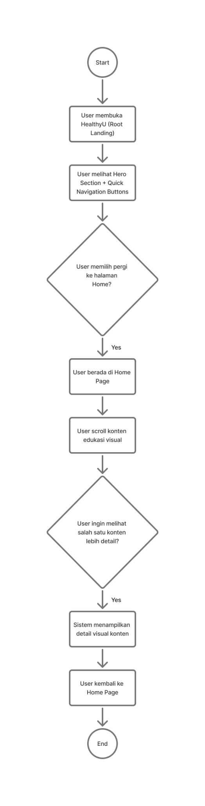
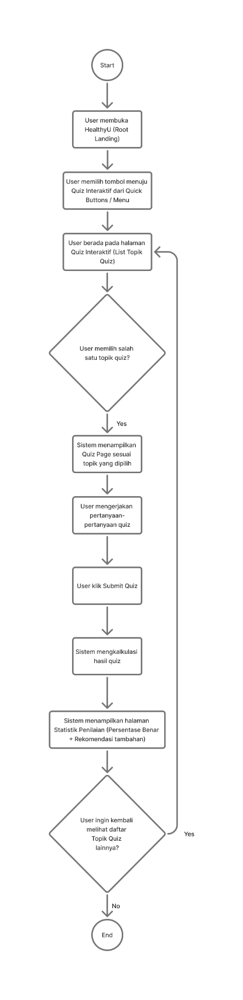
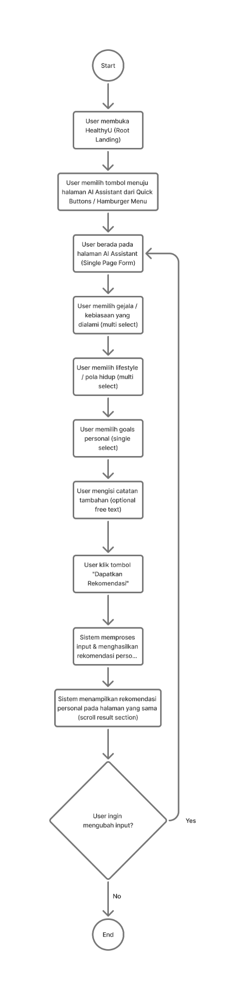

# Tugas Besar Interaksi Desain
## 🌐 Perancangan Prototype HealthyU – Platform Edukasi Kesehatan Asam Lambung

## 📝 Deskripsi Proyek
HealthyU merupakan platform edukasi kesehatan yang berfokus pada penyakit asam lambung. Website ini menyediakan artikel dari pakar, modul pembelajaran berupa video dan kuis interaktif, serta personal asisten yang membantu pengguna memahami gejala dan mendapatkan rekomendasi kesehatan yang sesuai.

Desain UI/UX HealthyU dirancang sederhana, informatif, dan mudah diakses agar pengguna dapat memahami informasi penting seputar penyebab, gejala, pencegahan, serta cara mengelola asam lambung tanpa kebingungan.

## Kelompok YuAyYuEx
## 👥 Anggota Kelompok
1. Rifka Priseilla Br Silitonga (123140024)
2. Pradana Figo Ariasya (123140063)
3. Elfa Noviana Sari (123140066)
4. Habbi Widagdo (123140204)

# 🧭 User Flow / Task Flow HealthyU

---

## 1. Task Flow – AI Assistant

### **Deskripsi Alur**
- Pengguna membuka halaman utama HealthyU.
- Pengguna memilih fitur **AI Assistant**.
- Pengguna mengisi gejala, kebiasaan, dan tujuan kesehatan.
- Sistem memproses input dan memberikan rekomendasi personal.
- Pengguna dapat mengubah input atau selesai.

---

## 2. Task Flow – Quiz Interaktif

### **Deskripsi Alur**
- Pengguna membuka halaman kuis.
- Memilih topik kuis.
- Mengisi dan menjawab pertanyaan.
- Menyelesaikan kuis dan menekan tombol submit.
- Sistem menampilkan skor dan penilaian.
- Pengguna dapat kembali memilih topik atau keluar.

---

## 3. Task Flow – Home & Visual Content

### **Deskripsi Alur**
- Pengguna masuk ke halaman Home.
- Menelusuri konten edukasi visual.
- Memilih salah satu materi untuk melihat detail.
- Membaca atau menonton konten edukasi.
- Pengguna kembali ke Home untuk melihat konten lainnya.

---
